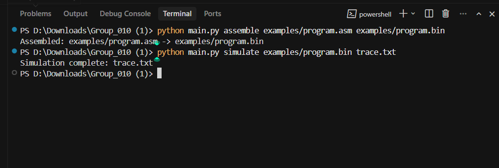
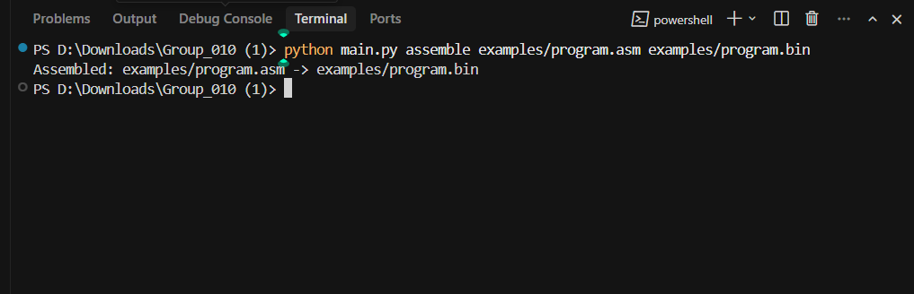
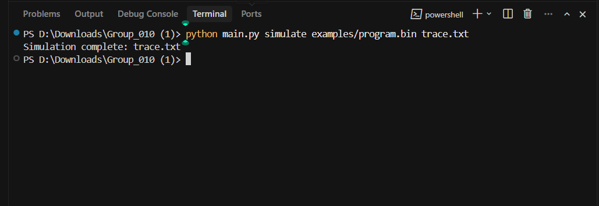
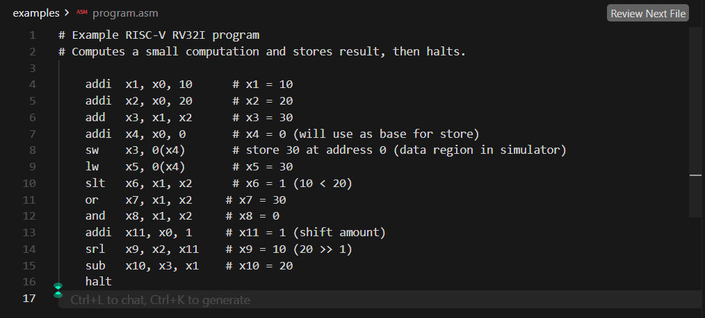
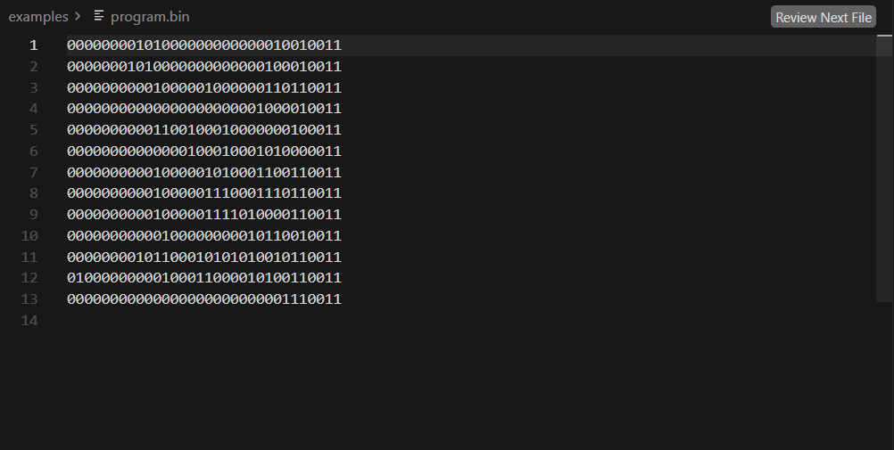
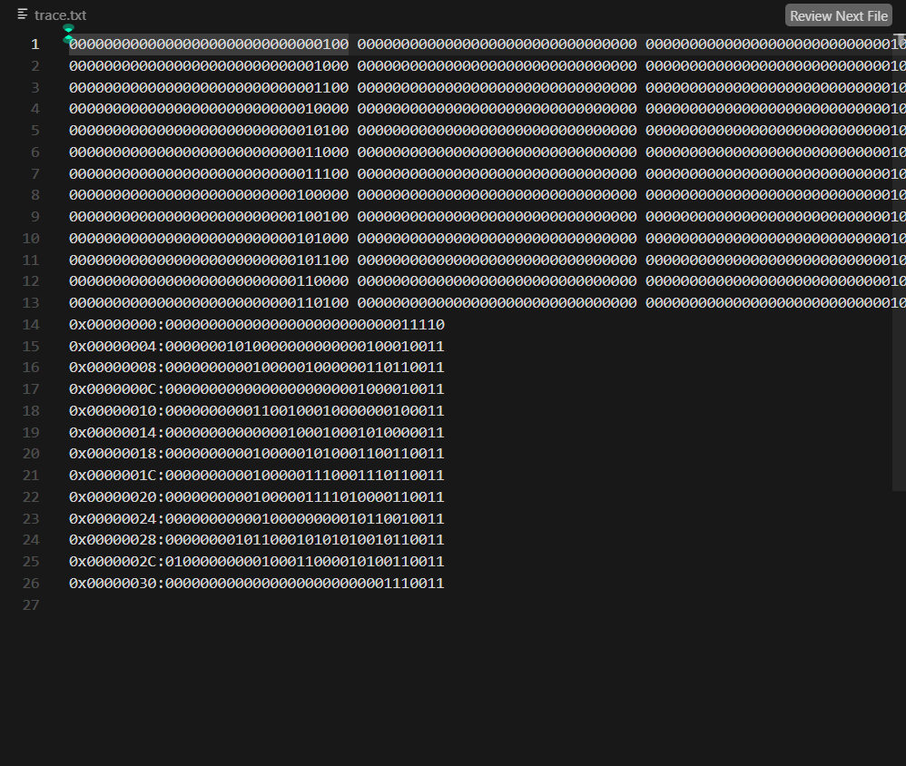
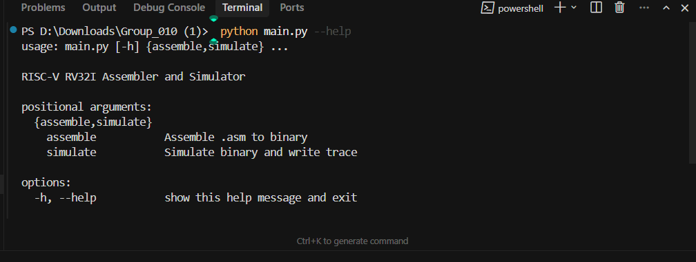

# RISC-V RV32I Assembler & Simulator

[](https://www.python.org/)
[](https://riscv.org/)
[](LICENSE)

A **fully functional RISC-V RV32I assembler and cycle-accurate simulator** built from scratch in Python. Converts assembly source to machine code, executes it in a virtual CPU, and produces detailed execution traces—ideal for computer architecture courses and as a portfolio demonstration of low-level systems understanding.

---

## What You'll See (No Setup Required)

The project works end-to-end. Here's the complete workflow in action:

<p align="center">
  
</p>
<p align="center"><i>Assemble assembly → binary, then simulate to produce execution trace</i></p>

---

## Project at a Glance

| Component   | Input              | Output                          |
|------------|--------------------|----------------------------------|
| **Assembler** | Assembly (`.asm`)  | 32-bit binary instructions (`.bin`) |
| **Simulator** | Binary (`.bin`)    | Execution trace + memory dump (`.txt`) |

```
┌─────────────┐     ┌────────────┐     ┌─────────────┐     ┌───────────┐     ┌─────────────────┐
│  Assembly   │────▶│  Assembler │────▶│   Binary    │────▶│  Simulator │────▶│ Execution Trace │
│  (.asm)     │     │  (parser,  │     │  (.bin)     │     │  (CPU,     │     │ + Memory Dump   │
│             │     │   encoder) │     │             │     │   memory)  │     │                 │
└─────────────┘     └────────────┘     └─────────────┘     └───────────┘     └─────────────────┘
```

---

## Screenshots

### 1. Assemble: Source → Binary

```bash
python main.py assemble examples/program.asm examples/program.bin
```



---

### 2. Simulate: Binary → Trace

```bash
python main.py simulate examples/program.bin trace.txt
```



---

### 3. Assembly Source Code

The example program exercises ADD, SUB, ADDI, LW, SW, SLT, OR, AND, and SRL instructions:



---

### 4. Binary Output

Each instruction is encoded as a 32-bit binary word:



---

### 5. Execution Trace & Memory Dump

After each instruction: PC and all 32 registers (32-bit binary). After halt: full memory dump.



---

### 6. CLI Help



---

## Supported Instruction Set

| Type | Instructions |
|------|---------------|
| **R-type** | add, sub, slt, srl, or, and |
| **I-type** | lw, addi, jalr |
| **S-type** | sw |
| **B-type** | beq, bne, blt |
| **J-type** | jal |
| **Pseudo** | rst, halt |

---

## Repository Structure

```
├── main.py                 # CLI: assemble / simulate
├── requirements.txt
├── src/
│   ├── assembler/          # Parser, encoder, instruction set
│   └── simulator/          # CPU, memory, decoder, execution
├── tests/                  # Unit tests (assembler + simulator)
├── examples/               # Sample .asm programs and outputs
└── docs/
    └── screenshots/        # README visuals
```

---

## How to Run

**Assemble:**
```bash
python main.py assemble examples/program.asm examples/program.bin
```

**Simulate:**
```bash
python main.py simulate examples/program.bin trace.txt
```

**Tests:**
```bash
pip install -r requirements.txt
pytest tests/ -v
```

---

## Example Program

**examples/program.asm**

```asm
    addi  x1, x0, 10      # x1 = 10
    addi  x2, x0, 20      # x2 = 20
    add   x3, x1, x2      # x3 = 30
    addi  x4, x0, 0       # x4 = 0
    sw    x3, 0(x4)       # store 30 at address 0
    lw    x5, 0(x4)       # x5 = 30
    slt   x6, x1, x2      # x6 = 1 (10 < 20)
    or    x7, x1, x2      # x7 = 30
    and   x8, x1, x2      # x8 = 0
    addi  x11, x0, 1      # shift amount
    srl   x9, x2, x11     # x9 = 10
    sub   x10, x3, x1     # x10 = 20
    halt
```

---

## License

MIT License. See [LICENSE](LICENSE).
